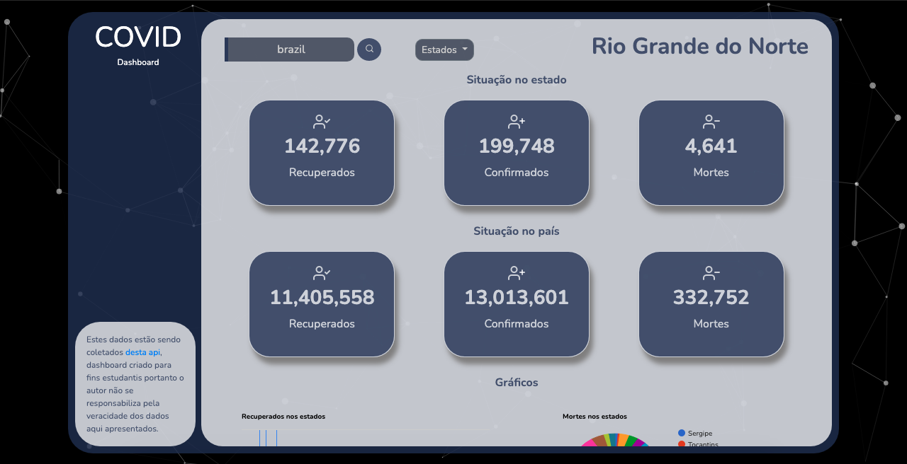

# Covid Dashboard

## Sobre o projeto
Este é um dashboard feito por mim que contém todos os dados mais recentes de todos os países do mundo(que divulgaram) e seus respectivos estados sobre o novo corona vírus, mostrando o número de recuperados, mortes e casos confirmados. Totalmente responsivo e funcional!

## Ferramentas utilizadas
- Javascript
- Axios
- Json
- HTML
- CSS
- Bootstrap

## Como usar
- Se seu navegador estiver em inglês, permita o acesso a localização para que ele busque automaticamente pelo seu estado :) !
- 1 - No campo de "Buscar país", digite o pais em que deseja pesquisar (em inglês);
- 2 - Em seguida, clique no botão de pesquisa com o icone - lupa, logo ao lado do campo;
- 3 - Após isso você verá os últimos dados do pais pesquisado;
- 4 - É possível também ver os dados dos respectivos estados do pais, para isso é só clicar no dropdown (menu) "estados";

## Screenshot

